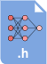

<h2>Chapter 3</h2>
<h1><b>Building a Weather Station with TensorFlow Lite for Microcontrollers</b></h1>

<h2> About this chapter </h2>

This chapter will teach us how to implement a simple weather station with machine learning (ML) to predict the occurrence of snowfall based on the temperature and humidity of the last three hours.

In the first part, we will focus on dataset preparation and show how to acquire historical weather data from WorldWeatherOnline. After preparing the dataset, we will show how to train a neural network with TensorFlow and quantize the model to 8-bit with TensorFlow Lite. In the last part, we will deploy the model on the Arduino Nano 33 BLE Sense and Raspberry Pi Pico with TensorFlow Lite for Microcontrollers to predict the occurrence of snowfall from the temperature and humidity recorded over the last three hours.

<h2> Devices </h2>

| Arduino Nano 33 BLE Sense (Rev1 and Rev2) | Raspberry Pi Pico | SparkFun RedBoard Artemis Nano |
| ----------- | ---------------------------------------------------------------- | -- |
| ✅ | ✅ | ✅ |

<h2> Hardware components </h2>

| Sensor  | Breadboard | Jumper wires | LEDs | Resistors | Extra |
| --------| -----------| ------------ | ---- | --------- | ----- |
| 1x AM2302 module with the DHT22 | 1x half-size | 3x | - | - | - |

<h2> Software (SW) Environments </h2>

| ML | Embedded programming |
| --------| -------------------- |
| Google Colaboratory | Arduino IDE (or Arduino Web Editor) |

<h2> Source code </h2>

<table class="fixed">
    <col width=50%/>
<tr>
    <th>Recipe</th>
    <th>Source code</th>
    <th>There's more</th>
</tr>
<tr style="height:72px">
    <td>Importing weather data from WorldWeatherOnline</td>
    <td>
        
    </td>
    <td>
        
    </td>
</tr>
<tr style="height:72px">
    <td>Preparing the dataset</td>
    <td>
        
    </td>
    <td>
        
    </td>
</tr>
<tr style="height:72px">
    <td>Training the model with TensorFlow </td>
    <td>
        
    </td>
    <td>
        
    </td>
</tr>
<tr style="height:72px">
    <td>Evaluating the model's effectiveness</td>
    <td>
        
    </td>
    <td>
        
    </td>
</tr>
<tr style="height:72px">
    <td>Quantizing the model with the TensorFlow Lite converter</td>
    <td>
        
        
    </td>
    <td>
        
    </td>
</tr>
<tr style="height:72px">
    <td>Reading temperature and humidity with the Arduino Nano</td>
    <td>
        
    </td>
    <td>
        
    </td>
</tr>
<tr style="height:72px">
    <td>Reading temperature and humidity with the DHT22 sensor and the Raspberry Pi Pico</td>
    <td>
        
    </td>
    <td>
        
        
    </td>
</tr>
<tr style="height:72px">
    <td>Preparing the input features for the model inference</td>
    <td>
        
    </td>
    <td>
        
    </td>
</tr>
<tr style="height:72px">
    <td>On-device inference with TensorFlow Lite for Microcontrollers</td>
    <td>
        
    </td>
    <td>
        
    </td>
</tr>
</table>