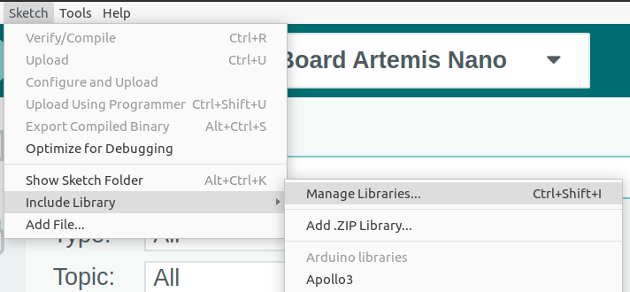

<h1><b> Install the OV7670 Arduino library in the Arduino IDE</b></h1>

<h2> Install the Arduino_OV767X library </h2>

<h3><b>Step 1</b></h3>

In the Arduino IDE, go to **Sketch** -> **Include Library** -> **Manage Libraries...**:

<h3><b>Step 2</b></h3>

In the **Library Manager** search box, search for **Arduino_OV767X** and install the **0.0.2** release:

