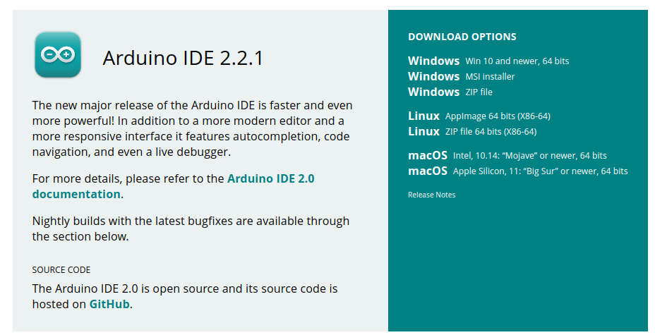
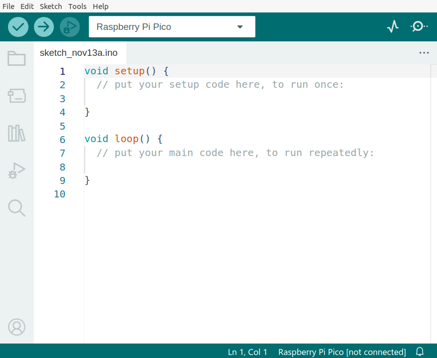
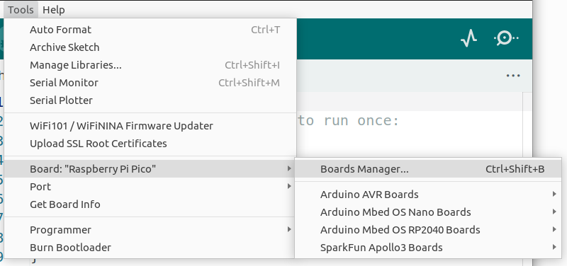
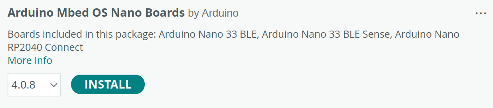
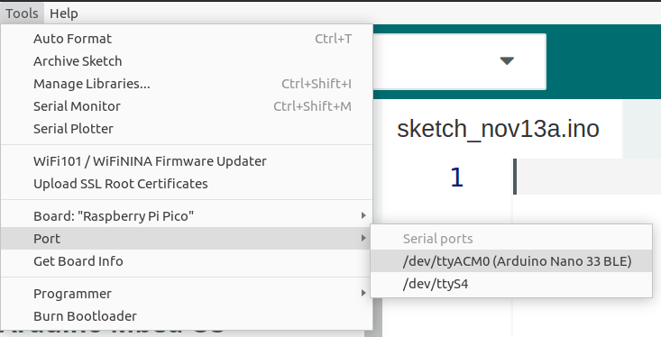
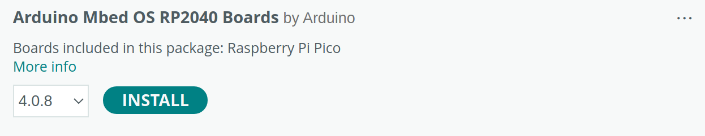
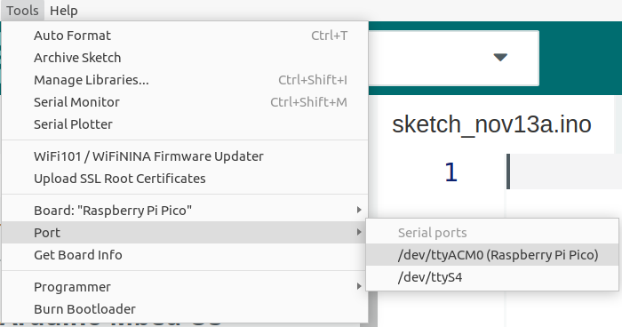
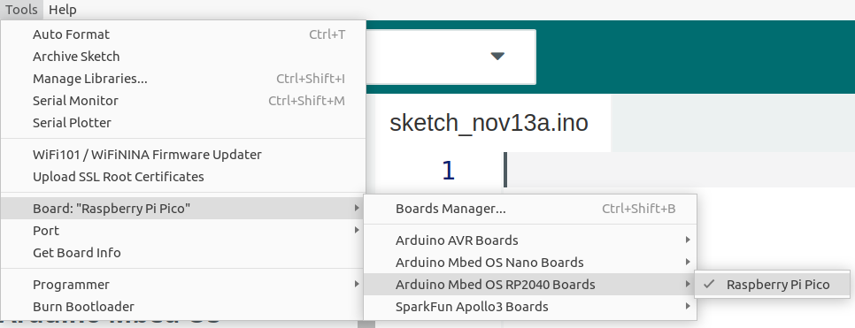
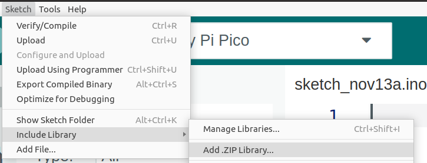
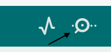

<h1><b> Setup the local Arduino IDE</b></h1>

<h2> Download and install Arduino IDE </h2>

<h3><b>Step 1</b></h3>

Download the Arduino IDE from **[here](https://www.arduino.cc/en/software)**:



<h3><b>Step 2</b></h3>

Refer to the **[Getting Started](https://www.arduino.cc/en/Guide)** page to install the software.

<h3><b>Step 3</b></h3>

Open Arduino IDE after the installation is finished:



<h2> Add support for the Arduino Nano 33 BLE Sense </h2>

<h3><b>Step 1</b></h3>

In the Arduino IDE, go to **Tools** -> **Board** -> **Boards Manager**:



<h3><b>Step 2</b></h3>

In the **Boards Manager** search box, search for "Mbed OS Nano" and install **Arduino Mbed OS Nano Boards**:



<h3><b>Step 3</b></h3>

Close Arduino IDE after the installation is finished.

<h3><b>Step 4</b></h3>

On Ubuntu, open a new **Terminal** and add a udev rule with the `post_install.sh` script:

```console
chmod +x ~/.arduino15/packages/arduino/hardware/mbed_nano/{version}/post_install.sh
sudo ~/.arduino15/packages/arduino/hardware/mbed_nano/{version}/post_install.sh
```

> ⚠️ In this particular example, `{version}` is 4.0.8, as reported in the field near the install button in the screenshot above.

<h3><b>Step 5</b></h3>

Open Arduino IDE and connect the Arduino 33 BLE Sense board to the laptop/PC through a micro-USB data cable. Go to **Tools** -> **Port** and check whether **Arduino Nano 33 BLE** is displayed:



You can now build the sketches for the Arduino Nano 33 BLE Sense.

<h2> Add support for the Raspberry Pi Pico </h2>

<h3><b>Step 1</b></h3>

In the Arduino IDE, go to **Tools** -> **Board** -> **Boards Manager**. Next, search for "RP2040" and install **Arduino Mbed OS RP2040 Boards**:



<h3><b>Step 2</b></h3>

Close Arduino IDE after the installation is finished.

<h3><b>Step 3</b></h3>

On Ubuntu, open a new **Terminal** and add a udev rule with the `post_install.sh` script:

```console
chmod +x ~/.arduino15/packages/arduino/hardware/mbed_rp2040/{version}/post_install.sh
sudo ~/.arduino15/packages/arduino/hardware/mbed_rp2040/{version}/post_install.sh
```
> ⚠️ In this particular example, `{version}` is 4.0.8, as reported in the field near the install button in the screenshot above.

<h3><b>Step 4</b></h3>

Open Arduino IDE and connect the Raspberry Pi Pico board to the laptop/PC through a micro-USB data cable. Go to **Tools** -> **Port** and check whether **Raspberry Pi Pico** is displayed:



You can now build the sketches for the Raspberry Pi Pico.

<h2> Upload a sketch to the board </h2>

<h3><b>Step 1</b></h3>

Connect the board (either the Arduino Nano 33 BLE Sense or the Raspberry Pi Pico) to the laptop/PC with the micro-USB data cable

<h3><b>Step 2</b></h3>

Select the board in **Tools** -> **Board**. For example, select **Raspberry Pi Pico** to upload a sketch to the Raspberry Pi Pico:



<h3><b>Step 3</b></h3>

Select the correct port for your board in **Tools** -> **Port**:


<h3><b>Step 4</b></h3>

Click on the **upload** button to compile and upload the sketch:


<h2> Import an Arduino library </h2>

Go to **Sketch** -> **Include Library** -> **Add .ZIP Library**:



<h2> Use the serial monitor </h2>



