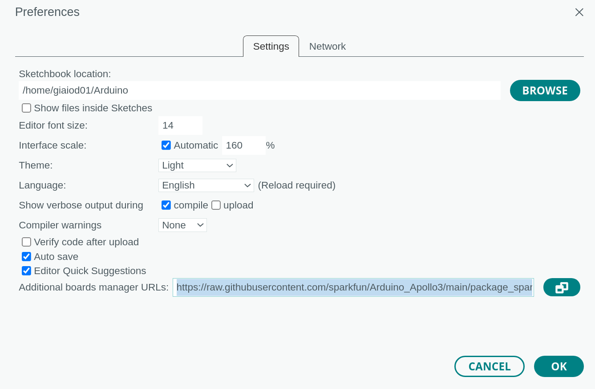
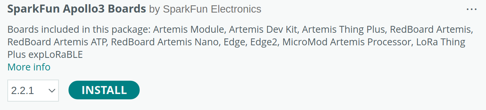

<h1><b>Setup SparkFun RedBoard Artemis Nano</b></h1>

For projects involving the <b>SparkFun RedBoard Artemis Nano</b>, you must use the local **[Arduino IDE](https://www.arduino.cc/en/software)**. Therefore, this guide will provide the instructions to set it up in the local Arduino IDE.

<h2> Download and install Arduino IDE </h2>

<h3><b>Step 1</b></h3>

Follow the instructions reported **[here](setup_local_arduino_ide.md)** to install Arduino IDE.

<h2> Add support for the SparkFun RedBoard Artemis Nano </h2>

<h3><b>Step 1</b></h3>

In the Arduino IDE, go to **File** -> **Preferences**:



In the **Additional boards manager URLs** field, add the following link to the Arduino configuration's file for the SparkFun microcontroller boards:
> https://raw.githubusercontent.com/sparkfun/Arduino_Apollo3/main/package_sparkfun_apollo3_index.json

Then, press the **OK** button to save the changes.

<h3><b>Step 2</b></h3>

In the Arduino IDE, go to **Tools** -> **Board** -> **Boards Manager**:


<h3><b>Step 3</b></h3>

In the **Boards Manager** search box, search for **SparkFun Apollo3 Boards** and install the **2.2.1** release:



<h3><b>Step 4</b></h3>

Close Arduino IDE after the installation is finished.

<h3><b>Step 5</b></h3>

Enter the Arduino **Board platforms and cores** directory (commonly called, **Arduino15**). To locate the path to this directory, you can refer to the **Board platforms and cores** section in the Arduino support guide, available at the following link:
> https://support.arduino.cc/hc/en-us/articles/4415103213714-Find-sketches-libraries-board-cores-and-other-files-on-your-computer

For example, on Linux, this folder is located in ```home/{username}/.arduino15```.

<h3><b>Step 6</b></h3>

Inside the **Arduino15** folder, remove the **arm_math.h** file in ```<Arduino15-path>/packages/SparkFun/hardware/apollo3/2.2.1/cores/mbed-os/cmsis/TARGET_CORTEX_M/```

For example, on Linux, this file is located in:
> home/{username}/.arduino15/packages/SparkFun/hardware/apollo3/2.2.1/cores/mbed-os/cmsis/TARGET_CORTEX_M/arm_math.h

This change is required to build sketches for the SparkFun RedBoard Artemis Nano with an updated **Arduino CMSIS-DSP** library.

> The **Arduino CMSIS-DSP** library will be used in *Chapter 6, Recognizing Music Genres with TensorFlow and the Raspberry Pi Pico* and *Chapter 12, Enabling Compelling tinyML Solutions with On-Device Learning and Scikit-Learn on the Arduino Nano and Raspberry Pi Pico*.

<h3><b>Step 7</b></h3>

Inside the **Arduino15** folder, open the **platform.txt** file in ```<Arduino15-path>/packages/SparkFun/hardware/apollo3/2.2.1/``` with your favorite text editor.

For example, on Linux, this file is located in:
> home/{username}/.arduino15/packages/SparkFun/hardware/apollo3/2.2.1/platform.txt

<h3><b>Step 8</b></h3>

In the **platform.txt** file, remove all references to **libs.extra**. Therefore, in the 2.2.1 release of the **SparkFun Apollo3 boards**,  the following must be removed:


>~~libs.extra=-Wl,--whole-archive "{cores.path}/mbed-os/targets/TARGET_Ambiq_Micro/TARGET_Apollo3/sdk/CMSIS/ARM/Lib/ARM/libarm_cortexM4lf_math.a" -Wl,--no-whole-archive~~\
\
libs.all={libs.core} {libs.mbed} {libs.variant} ~~{libs.extra}~~

Also this change is required to build sketches for the SparkFun RedBoard Artemis Nano with an updated **Arduino CMSIS-DSP** library.

Now, the core package for the SparkFun Artemis Nano is ready to be used.

